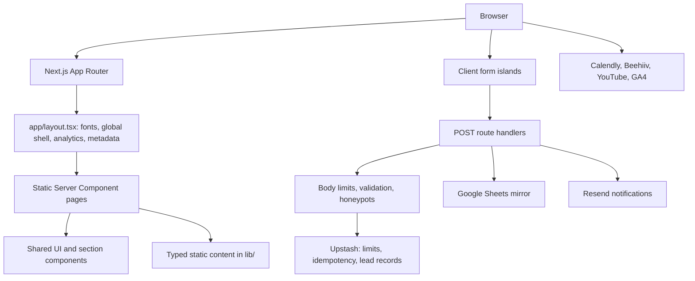

# Articog Project Health and Architecture Review

**Review date:** 2026-10-01  
**Scope:** Repository structure, rendering architecture, reuse, hardcoded content/configuration, performance practices, reliability, and local quality checks.  
**Review mode:** Architecture review plus a targeted video-loading improvement.

## Executive Summary

This is a content-led Next.js App Router marketing site with a sensible server-rendered default, reusable layout and UI foundations, static typed content, and three server-side form APIs. The architecture is understandable and the production build, lint, and TypeScript checks pass. Form handling has several good production safeguards: request validation, body limits, honeypots, shared Redis rate limits, idempotency, durable lead writes, and structured logs.

The project is **buildable and reasonably structured, with a few user-facing and operational gaps to close before calling it highly reliable**:

1. `CookieBanner` is implemented but not mounted in the root layout. The separate Privacy Choices page works, but visitors do not get the site-wide first-visit prompt that the code appears designed to show.
2. The video-loading path has been improved: the home hero MP4 waits for page load and browser idle, and decorative video is skipped for reduced-motion, Save-Data, and 2G cases. Services and pipeline posters now display before their video sources load.
3. External email calls have no explicit timeout or durable retry/outbox mechanism. A slow or ambiguous provider response can hold up a form request or leave notifications in an uncertain state after the lead is already saved.
4. Lead records are written to Redis without an expiry in this code path. The privacy policy promises deletion when information is no longer required, so a retention and deletion process needs to exist operationally or be added here.
5. The sitemap is an intentional six-route allowlist, but the existing site map and technical docs describe a different sitemap. This is an SEO/content-governance decision that needs one source of truth.
6. The build statically generates 37 legacy service detail pages that redirect. This adds generation work and leaves redirect-only page definitions/canonicals to maintain.
7. Three local MP4 files total about 17.2 MiB and have no source-code references found in the checked app/components. Verify production usage, then remove or relocate them if they are truly unused.

## Architecture

### Runtime shape

- Most public pages are static or statically generated Server Components. `next build` reported 104 static pages generated, including the dynamic parameter pages.
- The root layout provides global font loading, announcement/header/footer, analytics, toast notifications, and organization JSON-LD.
- Three Route Handlers serve `POST /api/contact`, `POST /api/demo`, and `POST /api/privacy-request`.
- Form content and site pages are not CMS-backed. The site uses TypeScript arrays/objects and route-local JSX.
- External systems are Upstash Redis, Resend, Google Sheets via an Apps Script URL, Calendly, Beehiiv, YouTube, and GA4.

### Form request path

1. Identify request and apply route/IP rate limits.
2. Parse a bounded JSON body and validate fields.
3. Short-circuit honeypot submissions where present.
4. Acquire a route-scoped idempotency lease.
5. Save the lead to Redis.
6. Mirror to Sheets and/or send Resend notifications.
7. Emit safe structured operational logs and return a generic client response.

Redis is the primary durable lead store in the documented design. Sheets is secondary for contact/demo submissions. The code does not use a background queue: provider calls happen inline in the request.

## What the Main Folders Do

| Path | Responsibility | Review notes |
| --- | --- | --- |
| `app/` | Routes, page metadata, API handlers, root layout, global CSS, robots and sitemap | Around 55 page files; most are statically rendered. Route-local copy and metadata are common. |
| `app/api/` | Three public form Route Handlers | Business-critical surface; provider and Redis failures need operational monitoring. |
| `components/ui/` | Shared primitives such as `Button`, `Link`, `Container`, `Section`, `Heading`, `PageHero`, inputs, select, accordion, and media wrappers | Good reuse foundation. Keep behavior and style changes centralized here. |
| `components/sections/` | Reusable marketing sections such as `Hero`, `Pipeline`, `CaseStudies`, `FinalCTA`, `IndustryDetails`, and `ServiceDetails` | Good for consistent page composition; some sections are intentionally client components for animation/media. |
| `components/layout/` | Header, mobile menu, footer, announcement bar, cookie consent, navigation panels | `CookieBanner.tsx` exists but is not rendered by `app/layout.tsx`. |
| `components/analytics/`, `components/animations/`, `components/search/`, `components/blog/`, `components/newsletter/`, `components/careers/` | Feature-specific client/provider components | Keeps vendor and interaction logic away from most page components. |
| `lib/` | Typed content, validation, storage, rate limiting, idempotency, email, analytics, SEO helpers, and shared utilities | Appropriate location for shared domain logic. Several content domains are still separate hardcoded arrays. |
| `hooks/` | Browser behavior such as buffered video autoplay and mobile state | `use-buffered-autoplay.ts` also respects reduced-motion preference and page visibility. |
| `types/` | Shared TypeScript domain contracts | Supports typed page content and component props. |
| `public/` | Static assets and crawler/search manifests | Public files are deployed as-is; large unused media can add deploy/storage cost. |
| `scripts/` | Image processing utility | `optimize:images` currently finds no `media-src/` directory and exits with an informational message. `sharp` resolves transitively from Next in this install. |
| `tests/` | Vitest unit/integration and source-guard tests | Good breadth over APIs/security/SEO, though several tests inspect source strings rather than rendered behavior. |
| `e2e/` | Playwright browser flows | Tests mock APIs and cover selected routes/forms and responsive widths. This run was canceled and is unverified for this review. |
| `docs/` | Site map and technical/deployment documentation | Current implementation has drifted from some documented route and sitemap descriptions. |
| `review/` | Design and review artifacts | This report is added here. |

## Reuse and Hardcoded Content

### Reusable components and abstractions

- **Global layout:** `app/layout.tsx` owns the shared page frame and metadata defaults.
- **Page structure:** `PageHero`, `PageHeroDetail`, `Section`, and `Container` centralize common spacing and layout.
- **UI primitives:** `Button`, `Link`, `Heading`, `Text`, `FormField`, `Input`, `Textarea`, `Select`, `Checkbox`, `Accordion`, and `Card` cover repeated controls and visual patterns.
- **Marketing sections:** `components/sections/` composes reusable content blocks across the home, service, industry, solution, and work pages.
- **Typed data:** `lib/content.ts`, `lib/blog.ts`, `lib/founders.ts`, and `lib/service-navigation.ts` separate selected content/navigation from JSX.
- **Shared server logic:** `api-validation.ts`, `rate-limit.ts`, `idempotency.ts`, `lead-storage.ts`, `resend.ts`, and `observability.ts` provide common policies for the form APIs.

The reuse strategy is strongest for layout, UI primitives, shared sections, and form infrastructure. It is not a fully data-driven page system; route pages still own substantial copy and composition, which is reasonable for a marketing site but creates more manual maintenance.

### Hardcoded or manually maintained values

| Location | What is maintained there | Reliability implication |
| --- | --- | --- |
| `lib/content.ts` | Home-page copy, capabilities, comparison rows, workflow steps, CTAs | Clear home-page source of truth, but arrays are edited manually. |
| `lib/blog.ts` | Native articles and external Medium/YouTube cards | No CMS workflow, schema validation, or automatic feed sync. New posts require code changes and a build. |
| `lib/founders.ts` | Founder profiles and biography data | Static and predictable; profile edits require code/deploy. |
| `lib/service-pages.ts` | 37 legacy service slugs and descriptions | These currently redirect and are still generated; appears to be legacy data with ongoing maintenance cost. |
| `lib/service-navigation.ts`, `components/layout/Header.tsx`, `components/layout/Footer.tsx` | Navigation groups and footer link groups | Service links are partly shared, but navigation is split across multiple files and can drift. |
| `app/**/page.tsx` and route layouts | Page copy, titles, descriptions, canonicals, legal text, schema details | Fine for curated pages, but repeated production URLs and metadata increase migration risk. |
| `next.config.ts` | Redirect map, CSP host allowlist, image hosts, cache rules | One large manual policy file; redirects and allowed provider hosts require careful review when integrations change. |
| `components/analytics/GoogleAnalytics.tsx` | A hardcoded fallback GA4 measurement ID | An unset environment variable still selects the embedded property ID, which can contaminate analytics in preview/development if consent is granted. |
| `app/layout.tsx`, `app/sitemap.ts`, schema builders | Production domain `https://www.articog.com` | Expected for a single-domain site, but domain changes require coordinated edits. |
| `public/search-index.json` | Search corpus | Must be updated when pages/content change; no generation/check command was found in the reviewed scripts. |
| `app/api/contact/route.ts` and API routes | Alert destinations/default email values | Environment overrides exist for some values; keep recipient policy consistent across routes. |

There is no application content database or CMS. This avoids runtime CMS availability/caching problems, but content updates are deployment-bound and the manually maintained search index, routes, sitemap, and redirect table can diverge.

## Performance Review

### Practices already in place

- Server Components/static generation are the default; client rendering is opted into by interactive islands. A source scan found 28 files marked `use client` across routes/components/hooks.
- `next/image` is configured for AVIF/WebP, responsive device sizes, explicit remote hosts, and approved quality values.
- The home visual gallery uses responsive sizes, lazy loading, and non-maximum quality rather than loading every full-size image eagerly.
- Home hero video uses a high-priority local poster and waits for page load plus browser idle before fetching the remote MP4. It skips video loading for reduced-motion, Save-Data, and 2G users.
- The pipeline waits until near the viewport before loading its source and displays its poster from the first render. `LazyVideo` waits for viewport relevance plus page-load/idle before attaching a source, and the services hero now has a poster fallback.
- The autoplay hook respects reduced-motion settings and pauses/retries based on visibility and buffering state.
- Calendly assets are scoped to the booking page. GA scripts are consent-gated and loaded after interaction/consent; the analytics event listener is installed only while consent is granted.
- `next.config.ts` applies long cache headers to selected immutable assets and allows only known remote image hosts.

### Performance risks and opportunities

1. **Unreferenced local videos:** `public/videos/pipeline.mp4` (8.45 MiB), `our-approach.mp4` (4.54 MiB), and `hero.mp4` (4.21 MiB) total about **17.2 MiB**. No references to these local paths were found under `app/` or `components/`; the corresponding visible sections use `media.articog.com` URLs. Verify production use and remove/relocate only if they are genuinely unused.
2. **Background media still depends on the remote host:** poster fallbacks now keep the hero areas visually complete while video loads, but playback still depends on `media.articog.com`. Monitor its response time and encode mobile-appropriate variants if transfer size remains high.
3. **Redirected SSG output:** the build still generates all 37 `/services/[slug]` legacy pages while `next.config.ts` redirects these slugs to category pages. Remove their static generation/data if these routes are retired, or intentionally restore their content if they are meant to be live.
4. **No measured Web Vitals baseline:** `tests/performance.test.ts` checks source-level performance conventions; it does not measure LCP, INP, CLS, transferred bytes, or real-device behavior. Add a repeatable Lighthouse/Web Vitals budget in CI or scheduled monitoring for representative mobile and desktop pages.
5. **Heavy media remains the main byte risk:** use poster-first delivery, responsive image sizing, and video encoding budgets. Check mobile data-saver behavior and provide a stable fallback if remote media fails.
6. **Image script has no current source input:** `npm run optimize:images` succeeds but reports that `media-src/` is absent, so it optimized no files. The current runtime media path is otherwise `next/image` plus hosted media, so this script may be obsolete or require a documented input workflow.

## Reliability, Security, and Operability

### Strong existing controls

- Public API bodies are bounded and parsed safely; fields use explicit validators and enums.
- Contact/demo forms use honeypots; all API endpoints apply shared, route-scoped rate limiting and fail closed when Redis is unavailable.
- HMAC-based idempotency prevents ordinary retry/concurrency duplicates; durable lead storage is attempted before non-essential mirroring/email in the contact/demo flows.
- User-facing errors are generic. Operational logs are structured and filter to an allowlist of safe fields rather than including payloads or provider bodies.
- Security headers include CSP, HSTS, frame/content-type protections, Referrer-Policy, and Permissions-Policy.

### Risks to address

1. **Email delivery is inline and unbounded by a timeout.** `lib/resend.ts` calls `fetch()` without an `AbortSignal` or deadline. A slow provider/network can consume the route's execution time. Add a timeout and decide explicitly which email failures should change form success. For stronger delivery guarantees, write notification jobs/outbox status durably and retry asynchronously rather than relying on a user retry.
2. **Privacy-request retry can duplicate notification attempts.** The privacy API saves the lead, then sends Resend, then marks the idempotency key complete. On email failure it releases the key, so retries are allowed even though the durable lead already exists. A timed-out response can also be ambiguous if the provider accepted the email. Store delivery status/outbox work separately and make retries idempotent per notification.
3. **Lead retention is not enforced by the Redis write shown.** `saveLead()` performs a `SET` with no expiry and the lead contains names, emails, and message/project data. The privacy policy describes retention in general terms, but this path has no TTL or deletion function. Define actual retention, access controls, backup retention, and a verified deletion workflow across Redis, Sheets, and email.
4. **Consent banner is disconnected.** `components/layout/CookieBanner.tsx` exposes Accept/Decline, but `app/layout.tsx` does not import or render it. The Privacy Choices page has consent controls, and the privacy/legal pages link there, but there is no global first-visit prompt. Either mount and test the banner, or remove/update the unused component and document the intended consent UX.
5. **Monitoring is log-only in this repository.** Structured logs and request IDs are a good base, but there is no error tracker, uptime check, alert configuration, or queue dashboard in code. Configure Vercel alerts for 5xx/Redis/email failures and an uptime check externally; document ownership and response thresholds.
6. **Shared dependency on Redis is deliberate but broad.** Rate limiting, idempotency, and lead persistence all use the same Upstash credentials/service. This gives cross-instance consistency, but an outage blocks all form submission. Keep fail-closed behavior if abuse protection is the priority; provide a visible fallback contact channel and alerting.

## SEO and Documentation Consistency

- `app/sitemap.ts` emits exactly six approved URLs. `tests/seo-indexing.test.ts` intentionally asserts this allowlist, and `robots.ts` permits crawling generally. Other pages can still be discovered through links, but they are not listed in the sitemap.
- `docs/SITE_MAP.md` is stale: it describes a much broader sitemap and claims all 37 service URLs remain listed. `README.md` and `docs/TECHNICAL_DOCUMENTATION.md` also describe sitemap generation behavior that no longer matches the six-item implementation.
- The canonical metadata on many omitted routes implies they are canonical pages, so decide whether the six-URL list is truly the desired indexable set. If yes, update docs and test naming to make the policy clear. If no, generate the sitemap from an approved route registry and include the routes that should be indexed.
- The six-URL allowlist and route metadata are maintained separately. A route registry shared by sitemap, navigation/search, and SEO tests would reduce drift.

## Current Validation Results

| Check | Result | Notes |
| --- | --- | --- |
| `npm run lint` | PASS | ESLint completed without reported issues. |
| `npx tsc --noEmit` | PASS | No TypeScript output/errors. |
| `npm run build` | PASS | Next generated 104 static pages. It also warned that a parent `C:\Users\kyath\package-lock.json` was ignored because it is outside this repository; make `turbopack.root` explicit if this workspace layout is intentional. |
| `npm test` | PASS | 18 test files and 114 tests pass after the poster and deferred-loading changes. |
| `npm run test:e2e` | NOT RUN | The browser-test command was canceled, so E2E behavior is unverified in this review. |
| Editor diagnostics | PASS | No errors were reported by the workspace diagnostics tool. |
| `npm run optimize:images` | No-op | Script reports no `media-src/` directory and optimizes nothing. `sharp` exists transitively through Next in the current install. |

The E2E tests mock the API routes, so even a green browser suite does not validate real Redis, Sheets, or Resend credentials/connectivity. The unit API tests do cover a useful set of mocked failure/retry cases.

## Recommended Work Order

1. Mount the consent banner in the root layout and add an integration test asserting it is rendered on a fresh visit and hidden after either choice; verify GA never loads before opt-in and honors GPC.
2. Set explicit timeout behavior for all outbound provider requests. Add persisted notification status/retry handling for privacy and other critical email events.
3. Define and enforce lead retention/deletion across Redis and Sheets; verify email copies/backups under the actual operating policy.
4. Decide sitemap scope, update docs to match, and avoid generating pages that only redirect.
5. Measure the updated media behavior on real mobile networks; audit large static media and remove verified-unused files. Add a measured Web Vitals budget and production-like browser checks.
6. Consolidate route/content/navigation references or document the hand-edit steps for new routes, especially the search index, redirects, sitemap, canonicals, and metadata.
7. Add runtime monitoring/alerts and a deployment checklist for required env vars and external integrations.

## Overall Assessment

The foundation is good: the project uses modern Next.js rendering defaults, a thoughtful set of shared components, strict TypeScript, typed static content, defensive API validation, and meaningful automated coverage. The initial video request is now deferred without sacrificing an immediate poster, but actual network performance still needs measurement. The highest-value remaining work is reconnecting the consent UI, bounding/retrying external side effects, defining personal-data retention, and aligning the sitemap/docs with the intended SEO policy.